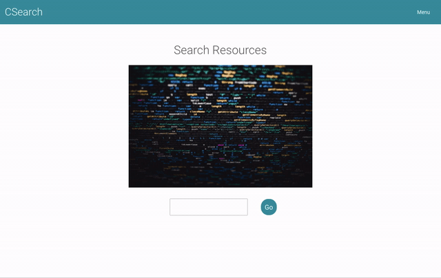
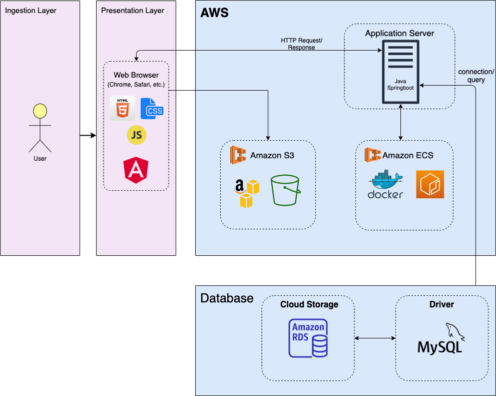
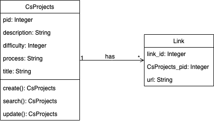
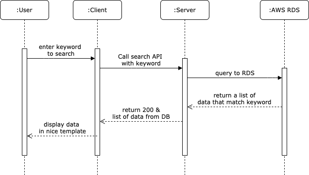

<h1 align="center">CSearch</h1>
<h3 align="center">
  San Jose State University - Enterprise Software - CMPE 172/Spring 2020
</h3>

<div align="center">
A search engine for software and computer science projects. Learn how to code, refresh on previous learned topics, and challenge yourself to continue learning new skills. It is a one-stop-shop for any and all computer science projects to help expand your knowledge and create awesome projects! </br></br>

<a href="https://github.com/ellamaolson/CSearch/pulls">
    
</a>

<a href="https://www.javascript.com/">
    
</a>




</div>

# 🌟 Features

- Search for a CS projects using any keywords
- Create a CS Project
- Read more detail about a project
- See all existing projects

# ✅ Getting Started

## 📍 Requirement

What things you need to install the software and how to install them

- [Java](https://java.com/en/download/help/download_options.xml)
- [Node.js](https://nodejs.org/en/) / [npm registry](https://www.npmjs.com/)
- [Angular CLI](https://github.com/angular/angular-cli)
- [VSCode](https://code.visualstudio.com/) OR ...any text editor you like.
- [IntelliJ](https://www.jetbrains.com/idea/)
- [Postman](https://www.getpostman.com/): Use for testing APIs without using the frontend
- [AWS CLI](https://aws.amazon.com/cli/)
- [Docker](https://www.docker.com/)
- [Maven](http://maven.apache.org/install.html)
- [MySQL](https://dev.mysql.com/doc/refman/8.0/en/installing.html).

## ⚒️ Installation

```sh
# Clone this repository
$ git clone https://github.com/ellamaolson/CSearch.git
```

## 💻 Client Start-up

The frontend (client) is an Angular application that is run using the Angular CLI.

```sh
# Install Angular CLI
$ npm install -g @angular/cli

# Install dependencies
$ cd client && npm i

# Start client on localhost:4200
$ npm start
```

## ⌨️ Server + Database Start-up

The backend (server) is a Java SpringBoot application that is run using Maven.

1. Create application.properties to init Database

```sh
# Go to server directory
$ cd server

# Create resources folder in main/
$ mkdir src/main/resources

# Create application.properties
$ touch src/main/resources/application.properties
```

2. Open application.properties and change `<db-name>` to your database and add your local MySQL username and password.

```java
spring.datasource.url=jdbc:mysql://localhost:3306/<db-name>?useUnicode=true&useJDBCCompliantTimezoneShift=true&useLegacyDatetimeCode=false&serverTimezone=UTC
spring.datasource.username=<your-db-username>
spring.datasource.password=<your-db-password>
spring.datasource.driver-class-name=com.mysql.cj.jdbc.Driver

spring.jpa.show-sql=true
spring.jpa.database-platform=org.hibernate.dialect.MySQL5Dialect
spring.jpa.hibernate.ddl-auto=update
```

If you want to use our AWS RDS, replace the first 3 lines with these:

```java
spring.datasource.url=jdbc:mysql://database-1.civmx6fdrslb.us-east-1.rds.amazonaws.com:3306/csearch
spring.datasource.username=root
spring.datasource.password=RDSdatabase
```

3. Run the project locally

```sh
# Clean & Instal Maven Project
$ mvn clean install

# Run application and open browser at localhost:8080
$ mvn spring-boot:run
```

# Docker

Build and run the server locally with Docker

```sh
# Go to server directory
$ cd server/

# Build CSearch into container using docker cli
$ docker build -t csearch .

# Run CSearch in localhost:8080/
$ docker run -p 8080:8080 csearch
```

# Running Docker on AWS ECR

```sh
# Install AWS CLI
$ brew install awscli

# Configure AWS Account
# Please Check the Test Account Credential in Final Report
$ aws configure
AWS Access Key ID [None]: <YOUR_ACCESS_KEY_HERE>
AWS Secret Access Key [None]: <YOUR_SECRET_KEY_HERE>
Default region name [None]: us-west-2
Default output format [None]: json

# run Docker AWS ECR
$ docker run -p 8080:8080 103806448707.dkr.ecr.us-east-1.amazonaws.com/csearch:latest
```

# Diagram

Within the docs folder you will find 3 diagrams that represent sample diagrams of our project's structure:

## 1. Project Architecture



## 2. UML Diagram



## 3. Sequence Diagram



# Database

## Schema

We have 2 main models:

1. CsProject

```java
@Entity
@Table(name = "csprojects")
public class CsProject {
  @Id
  @GeneratedValue(strategy = GenerationType.AUTO)
  @Column(name = "pid")
  private int id;
  private String title;
  private String description;
  private String process;
  private int difficulty;

  public CsProject() {
    setTitle("");
    setDescription("");
    setProcess("");
    setDifficulty(0);
  }

  public CsProject(String title, String description, String process, int difficulty) {
    setTitle(title);
    setDescription(description);
    setProcess(process);
    setDifficulty(difficulty);
  }
```

2. Link

```java
@Entity
@Table(name = "links")
public class Link {
  @Id
  @GeneratedValue(strategy = GenerationType.AUTO)
  private int id;
  private String link;
  private int pid; // project id to which the link relates to

  public Link(String link, int pid) {
    this.link = link;
    this.pid = pid;
  }
```

## Database Queries

We have 2 custom queries to get the result we want by searching the keywords.

1. `CsRepository.java`

```java
@Repository("csrepo")
public interface CsRepository extends CrudRepository<CsProject, Integer> {
    @Query(value = "SELECT pid, title, description, process, difficulty FROM csprojects cs WHERE cs.title LIKE " +
      "%:searchTerm% OR cs.description LIKE %:searchTerm% OR cs.process LIKE %:searchTerm%", nativeQuery = true)
    List<CsProject> findProjectMatchingSearchTerm(String searchTerm);
}
```

2. `LinkRepository.java`

```java
@Repository("lrepo")
public interface LinkRepository extends CrudRepository<Link, Integer> {

  @Query( value = "select id,link,pid from links where pid=:l_pid", nativeQuery = true)
  List<Link> findByPid(int l_pid);
}
```

# Mid tier APIs

## How Angular call Server APIs

```typescript
// Create a CS Projects
create(resource) {
    return this.http.post(`uri/csproject`, resource);
}

// Display All CS Projects
getAll() {
    return this.http.get(`uri/all`, httpHeaders);
}

// Search a specific project based on given keywords
search(term) {
    return this.http.get(`uri/search/` + term, httpHeaders);
}
```

## Server APIs

```java
@PostMapping("/csproject")
public CsProject create(@RequestBody Map<String, String> body) {
    title = body.get("title");
    description = body.get("description");
    process = body.get("process");
    difficulty = body.get("difficulty");
    links = body.get("links");

    CsProject project = new CsProject(title, description, process, difficulty);
    this.csRepo.save(project);
    return getProjectById(project.getId());
}

@GetMapping("/all")
 public List<Pair> index() {
   return createList((List<CsProject>) this.csRepo.findAll());
 }

@GetMapping("/search/{searchTerm}")
  public List<Pair> search(@PathVariable(value = "searchTerm") String searchTerm) {
    return creatList(this.csRepo.findSearchTerm(searchTerm));
}
```

# UI data transport

1. Click [here](https://github.com/ellamaolson/CSearch/blob/master/server/pom.xml) to check for all server's dependencies that we use

2. We use `package.json` to keep all dependencies and contain scripts to run the frontend. Click [here](https://github.com/ellamaolson/CSearch/blob/master/client/package.json) to view our front-end configuration

# ⭐️ Authors

👨🏻‍💻 **Calvin Nguyen** - [calvinqc](https://github.com/calvinqc)

👩🏻‍💻 **Elana Olson** - [ellamaolson](https://github.com/ellamaolson)

👩🏻‍💻 **Aleksandra Kovina** - [Aleksandra Kovina](https://github.com/Sashanity)

See also the list of [contributors](https://github.com/DPA-SJSU/Degree-Planning-Assistant/contributors) who participated in this project.

# License

Use of this source code is governed by an **MIT license**.
